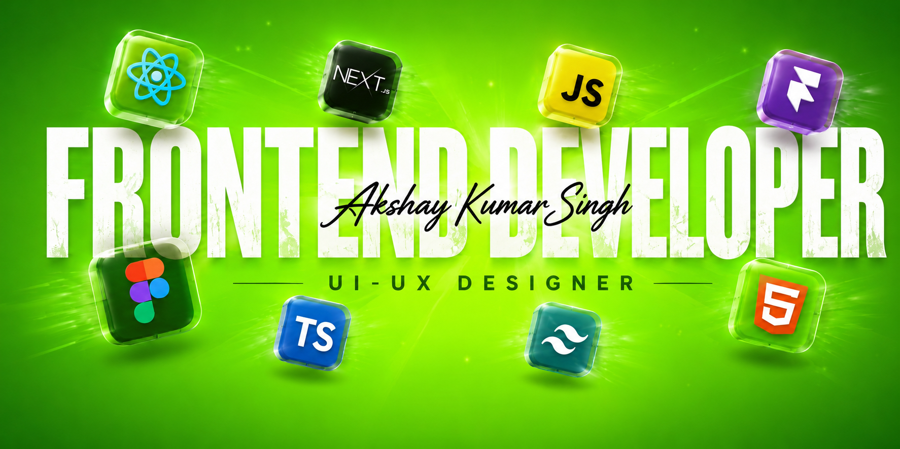

<!-- ═══════════════════════════════════════════════════════════
     HERO BANNER
═══════════════════════════════════════════════════════════════ -->

  

 

<!-- ═══════════════════════════════════════════════════════════
     ROTATING ROLES
═══════════════════════════════════════════════════════════════ -->

  

 

<!-- ═══════════════════════════════════════════════════════════
     DIL SE ❤️ DEVELOPER
═══════════════════════════════════════════════════════════════ -->

  

<!-- ═══════════════════════════════════════════════════════════
     TAGLINE + CONNECT
     LinkedIn: raw SVG from skill-icons (real blue square with "in")
═══════════════════════════════════════════════════════════════ -->

  
Crafting modern user experiences, scalable web applications, and AI-powered productivity solutions.

   
  
  &nbsp;
  
  &nbsp;
  

 

---

<!-- ═══════════════════════════════════════════════════════════
     1. ABOUT — centered
═══════════════════════════════════════════════════════════════ -->

###  &nbsp;About

I build purposeful digital products at the intersection of design and engineering.
My work spans React ecosystems, Next.js, modern UI systems, and AI-assisted productivity workflows with n8n.
Currently expanding into full-stack architecture.
Open to collaborations, open source, and projects that push the boundary of web experience.

---

<!-- ═══════════════════════════════════════════════════════════
     2. PROFILE STATS SVGs — side by side, full width
═══════════════════════════════════════════════════════════════ -->

  
  &nbsp;
  

 

---

<!-- ═══════════════════════════════════════════════════════════
     3. CURRENT FOCUS — HTML table, smaller font, no header row
═══════════════════════════════════════════════════════════════ -->

###  &nbsp;Current Focus

 

<table>
  <tr>
    <td align="center"></td>
    <td><strong>IIT Roorkee Hackathon · 2025</strong></td>
  </tr>
  <tr>
    <td align="center"></td>
    <td><strong>React · Node.js · MongoDB</strong></td>
  </tr>
  <tr>
    <td align="center"></td>
    <td><strong>Server-Side Engineering</strong></td>
  </tr>
  <tr>
    <td align="center"></td>
    <td><strong>n8n Automation Workflows</strong></td>
  </tr>
  <tr>
    <td align="center"></td>
    <td><strong>React & Next.js</strong></td>
  </tr>
</table>

 

---

<!-- ═══════════════════════════════════════════════════════════
     4. STACK
═══════════════════════════════════════════════════════════════ -->

## Stack

<!-- ── FRONTEND ─────────────────────────────────────────── -->

  

 

  
  &nbsp;&nbsp;&nbsp;
  
  &nbsp;&nbsp;&nbsp;
  
  &nbsp;&nbsp;&nbsp;
  
  &nbsp;&nbsp;&nbsp;
  
  &nbsp;&nbsp;&nbsp;
  
  &nbsp;&nbsp;&nbsp;
  
  &nbsp;&nbsp;&nbsp;
  

  

<!-- ── LANGUAGE ────────────────────────────────────────── -->

  

 

  

  

<!-- ── DESIGN — single row, no Lightroom ─────────────────── -->

  

 

  
  &nbsp;&nbsp;&nbsp;
  
  &nbsp;&nbsp;&nbsp;
  
  &nbsp;&nbsp;&nbsp;
  
  &nbsp;&nbsp;&nbsp;
  

  

<!-- ── TOOLS ───────────────────────────────────────────── -->

  

 

  
  &nbsp;&nbsp;&nbsp;
  
  &nbsp;&nbsp;&nbsp;
  
  &nbsp;&nbsp;&nbsp;
  

---

<!-- ═══════════════════════════════════════════════════════════
     5. GITHUB — streak + activity graph + snake
═══════════════════════════════════════════════════════════════ -->

## GitHub

  

 

  

 

  

---

<!-- ═══════════════════════════════════════════════════════════
     6. PROJECTS
═══════════════════════════════════════════════════════════════ -->

## Projects

<table width="100%">
  <tr>
    <td width="50%" valign="top">
      <h2>HPCL Intel</h2>
      <h4>AI-Powered Sales Intelligence Platform</h4>
      

        
      

      
AI-powered sales intelligence platform leveraging web scraping, analytics, and automation to deliver actionable business insights.

      

        
        
        
        
        
      

      

        
        &nbsp;
        
      

    </td>
    <td width="50%" valign="top">
      <h2>RishiSphere</h2>
      <h4>Unified Campus Event Ecosystem</h4>
      

        
      

      
One calendar for every campus event. Eliminates scheduling conflicts, centralizes participation, and gives administrators complete visibility into campus activity.

      

        
        
        
        
        
      

      

        
        &nbsp;
        
      

    </td>
  </tr>
</table>

---

<!-- ═══════════════════════════════════════════════════════════
     CONNECT
═══════════════════════════════════════════════════════════════ -->

  
  &nbsp;
  
  &nbsp;
  

